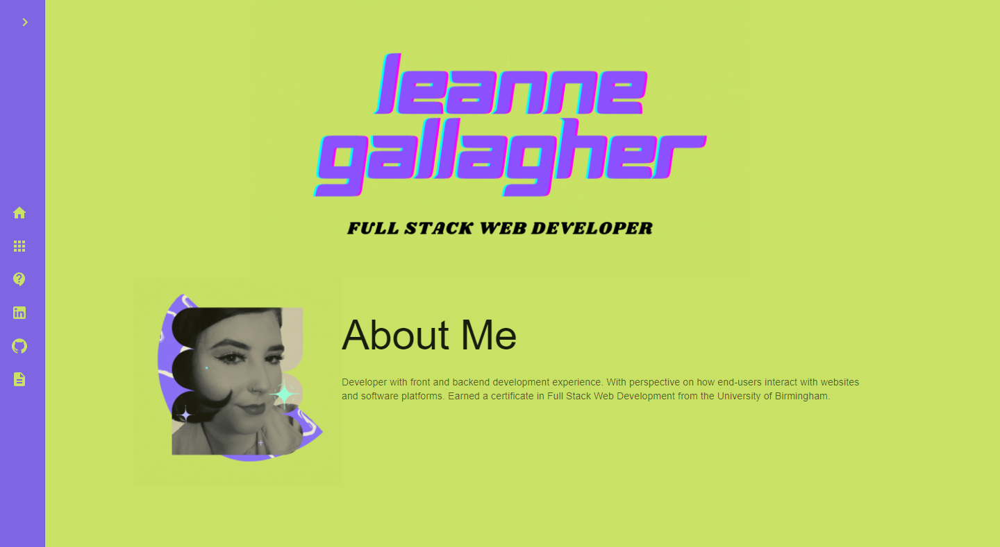
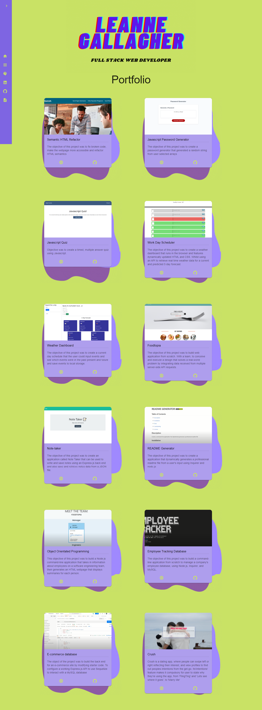
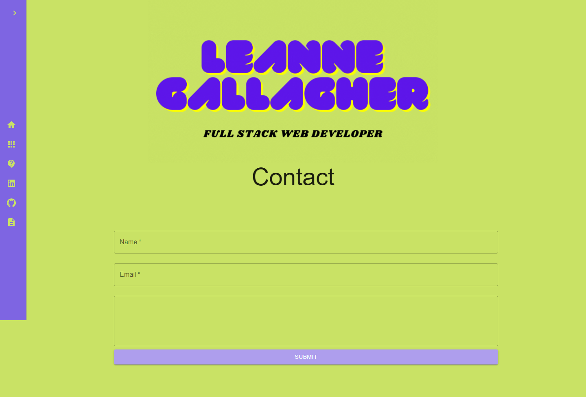

# React Portfolio

## Description

The objective of this task was to create a portfolio using our new React skills, to set us apart from other developers whose portfolios don’t use the latest technologies.

you can find the deployed website [here](https://lenny-g.github.io/react-portfolio/)

## Screenshots

### Please Note the screenshots were unable to capture the full length of the navbar which covers the entire page
